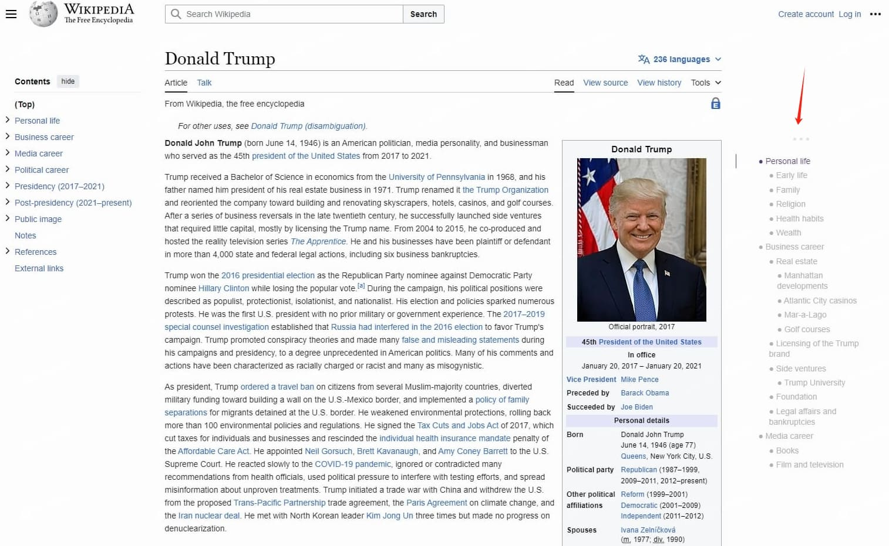

# auto-toc

Displays a table of contents for any website, making it easier to read and navigate long articles, documentations, and online books.

Generate TOC(table of contents) for any website. 可以为任何网站生成TOC网站目录大纲.

# 高级技巧Advanced Skills 

- Drag the `TOC drag bar`(that three dots) to move `auto-toc`.
- 拖动 TOC拖动栏 来移动 `auto-toc`
- Clicking on the `TOC drag bar`(that three dots) to toggle headings text wrap.
- 单击 TOC拖动栏(三个圆点) 可以切换标题折行
- Double-clicking on the `TOC drag bar`(that three dots) to automatically dim the TOC..
- 双击 TOC拖动栏(三个圆点) 可以自动折叠 TOC
<!-- - now you can resize auto-toc by puting the pointer on the bottom right corner of auto-toc and draging it.
- 现在你可以设置auto-toc的宽度了, 把你鼠标放到auto-toc的右下角然后拖动即可 -->

# Features

- Work properly on any website that conforms to the HTML standard and uses HTML heading tags properly (e.g. Wikipedia.com). 
- Accurate article and heading detection
- A clean user interface
- Highlight current heading
- Click to jump to headings
- Drag the panel to your preferred position
- Only runs when you actually use it
- Dark mode, automatically
- 6 heading levels
- Expand all headings to a specific level
- Support HTML label:
  - `H1`, `H2`, `H3`, `H4`, `H5`, `H6`
  - `<strong>`
  - `<b>`
- Anti-Google-Redirect
- Anti-Jumping-Warnings
- Hide-Zhihu-Top-Bar-When-Scrolling-Down
- Touch-Fish(Shrink IMG)

# 捐赠

捐赠! 让作者更有动力给 auto-toc 加新功能! ^_^

- 微信
  - 
- 支付宝
  - 

# Installation & Usage

- English: https://greasyfork.org/en/scripts/458022-auto-toc?locale_override=1
- 中文: https://greasyfork.org/zh-CN/scripts/458022-auto-toc?locale_override=1

By default, it is not open. You need to go to the plug-in menu to open the switch for the website that wants to open the toc. The plug-in will remember this switch, and the toc will be generated automatically according to the switch when you open the website the next time.

可以为任何网站生成TOC网站目录大纲, 默认是不打开的, 需要去插件菜单里为想要打开 toc 的网站开启开关, 插件会记住这个开关, 下回再打开这个网站会自动根据开关来生成 toc 与否.

# Inspired by

- https://chrome.google.com/webstore/detail/lifgeihcfpkmmlfjbailfpfhbahhibba