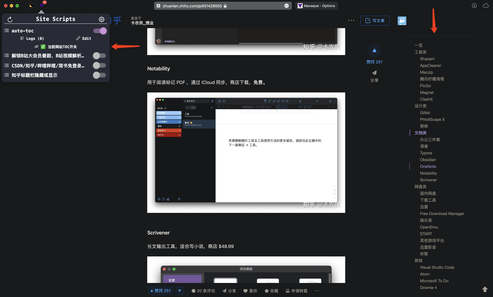

# auto-toc
                  
support any website

support HTML label:                

- `H1`, `H2`, `H3`, `H4`, `H5`, `H6`
- `<strong>`
- `<b>`

inspired by:

- https://github.com/FallenMax/smart-toc 
- https://chrome.google.com/webstore/detail/lifgeihcfpkmmlfjbailfpfhbahhibba
- https://greasyfork.org/en/scripts/415856-bc-smarttoc