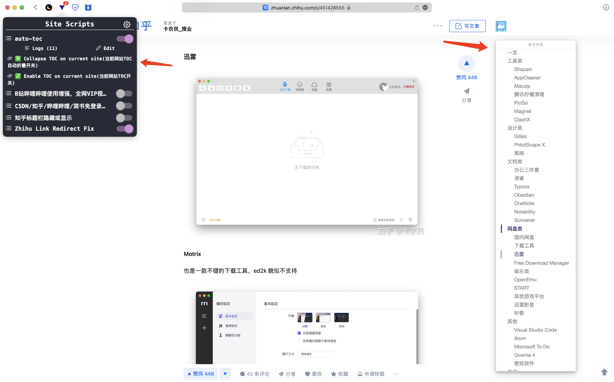
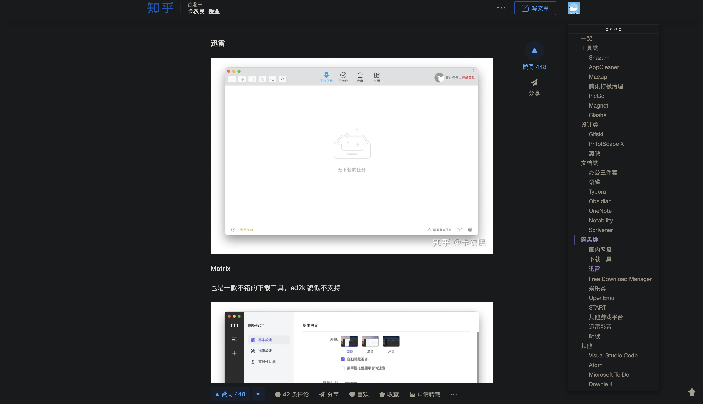

# auto-toc
                  
Generate TOC(table of contents) for any website. 可以为任何网站生成TOC网站目录大纲.

Switch black/white themes automatically according to your compupter's light/dark mode. 会根据你的电脑的黑夜白天模式自动切换黑白主题.

support HTML label:                

- `H1`, `H2`, `H3`, `H4`, `H5`, `H6`
- `<strong>`
- `<b>`

# Installation

- English: https://greasyfork.org/en/scripts/458022-auto-toc?locale_override=1
- 中文: https://greasyfork.org/zh-CN/scripts/458022-auto-toc?locale_override=1

# Inspired by

- https://github.com/FallenMax/smart-toc 
- https://chrome.google.com/webstore/detail/lifgeihcfpkmmlfjbailfpfhbahhibba
- https://greasyfork.org/en/scripts/415856-bc-smarttoc